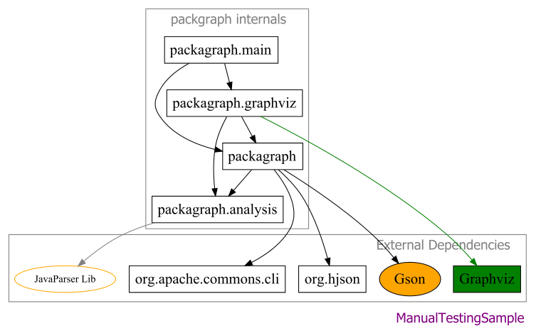

# packagraph

Is a small tool that generates package diagrams from Java source code
directories and exports them to customizable graphs. Packagraph's input is only a
[Human JSON](https://hjson.github.io/) file, which contains all the options
and configurations of the exported graph.

Below is the package diagram of packgraph itself, demonstrating various features.
Given [for_manual_testing.hjson](./src/test/resources/for_manual_testing.hjson), the output is:



## Motivation:

A "simple & easy to use" tool to visualize Java packages and their dependencies. In a sense, to replace on the
package-level the
no-longer maintained ObjectAid (see
on [WebArchive](https://web.archive.org/web/20200418031122/http://www.objectaid.com/home)).

## How it works:

packagraph scans the Java files within the directories given as input and then finds the packages and their
dependencies.
The detection of the dependencies is based on the `import` statements within the `.java` files of each package. Then,
packagraph uses [GraphViz](https://graphviz.org/) library to generate and export the graph.

## How to use:

As a regular Java command line tool.

#### For example:

```bash
java -jar packagraph.jar -o myOptions.hjson
```

Below is all the properties that can be defined in the HJson file and supported by packagraph (*required):
<table>
  <thead>
    <tr>
      <th>Property</th>
      <th>Type</th>
      <th>Description</th>
      <th>Example Value</th>
    </tr>
  </thead>
  <tbody>
    <tr>
      <td>directories*</td>
      <td>String[]</td>
      <td>Base directories that contain (source code) java packages. Could be as simple as "src/main/java" or directories of multiple modules.</td>
      <td>
            <pre>
"directories": [
    "./myModule1/src/main/java",
    "./myModule2/src/main/java"
]</pre>
      </td>
    </tr>
    <tr>
      <td>output.path*</td>
      <td>String</td>
      <td>Defines the output file path and file type. Please see the <a href="https://graphviz.org/docs/outputs/">GraphViz output formats</a>.</td>
      <td rowspan="3">
        <pre>
"output": {
    //PNG output
    "path": "./packagraph.png", 
    "overwrite": true,
    "style": {
    #Label of the main graph
      "label": "MyLabel",
      "fontsize": 24,
      "fontcolor": "purple",
      "dpi": 96
    }
}
</pre>
      </td>
    </tr>
    <tr>
      <td>output.overwrite</td>
      <td>boolean</td>
      <td>Whether to overwrite the output file if it already exists.</td>
    </tr>
    <tr>
      <td>output.style</td>
      <td>Object</td>
      <td>A set of key-value pairs of GraphViz attributes to be applied to the main graph.  Please see the <a href="https://graphviz.org/doc/info/attrs.html">GraphViz attributes</a> that can be applied to a graph.</td>
    </tr>
    <tr>
      <td>includeOnlyFromDirectories</td>
      <td>boolean</td>
      <td>If true, only packages sourced from the <code>directories</code> will be included in the graph.</td>
    <td><pre>"includeOnlyFromDirectories": true</pre></td>
    </tr>
    <tr>
      <td>definitions</td>
      <td>Object[]</td>
      <td>Definitions can be used to re-name (or group into one) some of the packages. For example, you could define that packages <code>javax.persistence.*</code> and <code>org.springframework.jpa.*</code> will be exported as a single <code>JPA</code> package.</td>
      <td rowspan="5">
<pre>
"definitions": [
    {
      "packages": "org.spring.data.*",
      "as": "Spring Data",
      "style": {
        // Database has 'green' node
        "fillcolor": "green"
      },
      "edgeInStyle": {
        // Database node has 'green' edges
        "color": "green"
      }
    },
    {
      "packages": "java.*", //JDK standards
      "as": "" //exclude from the graph
    },
    {
      //Trim the 'com.something.' prefix
      //com.smth.pack1 and com.smth.pack2 
      //will become just 'pack1' and 'pack2'
      "packages": "com.smth\\.(.*)",
      "as": "$1",
      "style": {
          "shape": "rectangle"
      }
    }
]
</pre>
</td>
    </tr>
    <tr>
      <td>definition(s).packages*</td>
      <td>String</td>
      <td>The packages that this definition refers to. You can use comma for multiple packages and regular expressions.</td>
    </tr>
    <tr>
      <td>definition(s).as*</td>
      <td>String</td>
      <td>The name of the re-defined package. In other words, how the package will be shown in the output graph. If this value is empty, the package is completely excluded from the graph.</td>
    </tr>
    <tr>
      <td>definition(s).style</td>
      <td>Object</td>
      <td>Each package is exported to the graph as an individual node. <code>style</code> 
property can be used to customize the node of a single package. Please see the <a href="https://graphviz.org/doc/info/attrs.html">GraphViz attributes</a> that can be applied to a node.</td>
    </tr>
    <tr>
      <td>definition(s).edgeInStyle</td>
      <td>Object</td>
      <td>Customize the edges (that point to) of a single package. Please see the <a href="https://graphviz.org/doc/info/attrs.html">GraphViz attributes</a> that can be applied to an edge.</td>
    </tr>
    <tr>
      <td>globalStyle</td>
      <td>Object</td>
      <td>The default style of the nodes in the graph. Please see the <a href="https://graphviz.org/doc/info/attrs.html">GraphViz attributes</a> that 
can be applied to a node. All nodes will inherit the attributes of this style by default. 
Use <code>"inheritGlobal" : false</code> property in the specific package definition
(<code>style</code>)</code>to disable the inheritance.</td>
    <td><pre>
//Style applied to all package nodes
//use definitions.style to override 
//them for specific package nodes
"globalStyle": {
    "fontsize": 20,
    "shape": "box"
},
</pre></td>
    </tr>
    <tr>
      <td>globalEdgeStyle</td>
      <td>Object</td>
      <td>The default style of the edges in the graph. Please see the <a href="https://graphviz.org/doc/info/attrs.html">GraphViz attributes</a> that 
can be applied to an edge. All edges will inherit the attributes of this style by default. 
Use <code>"inheritGlobal" : false</code> property in the specific package definition 
(<code>edgeInStyle</code>)</code> to disable the inheritance.</td>
    <td><pre>
//Style applied to all edges
//use definitions.edgeInStyle to override 
//them for specific package nodes
"globalEdgeStyle": {
    "color": "black",
    "arrowhead": "diamond"
},
</pre></td>
    </tr>
    <tr>
      <td>clusters</td>
      <td>Object[]</td>
      <td>Clusters allow you to group several packages into a single type of sub-graph.
More information on <a href="https://graphviz.org/Gallery/directed/cluster.html">GraphViz clusters</a>.</td>
    <td rowspan="4">
<pre>
"definitions": [
{
  "packages": "org.hibernate.*",
  "as": "Hibernate"
},
{
  "packages": "jakarta.persistence.*",
  "as": "JPA"
}
],
"clusters": [
    {
      "packages": "JPA,Hibernate,
    org.springframework.data.*",
      "style": {
        "label": "Database Access Layer",
        "fontsize": 18,
        "fontcolor": "gray"
      }
    }
]
</pre>
</td>
    </tr>
    <tr>
      <td>cluster(s).packages*</td>
      <td>String</td>
      <td>A comma-separated list of packages that will be grouped within the cluster. 
Please note that at this stage, you have to refer to the packages based in their re-defined
names specified in<code>definitions</code>.</td>
    </tr>
    <tr>
      <td>cluster(s).name</td>
      <td>String</td>
      <td>The name of the cluster, to be used as an identifier. Does not have any impact on the output.</td>
    </tr>
    <tr>
      <td>cluster(s).style</td>
      <td>Object</td>
      <td>The style of the cluster graph. By default, all cluster graphs have the same <code>style</code>
as the main graph (<code>output.style</code>). Please see the 
<a href="https://graphviz.org/doc/info/attrs.html">GraphViz attributes</a> that can be 
applied to a graph.</td>
    </tr>
    <tr>
      <td>constants</td>
      <td>Object[]</td>
      <td>A list of "key-value" pairs defined as constants within the Hjson file.
Use the <code>${MY_CONSTANT}</code> syntax to refer to a constant.</td>
    <td rowspan="3">
<pre>
"constants": [
    {
      "name": "EDGE_CUSTOM_BLUE",
      "value": "#258fc4"
    }
]
"globalEdgeStyle": {
    "color": "${EDGE_CUSTOM_BLUE}"
},
</pre></td>
    </tr>
    <tr>
      <td>constant(s).name*</td>
      <td>String</td>
      <td>The name of the constant</td>
    </tr>
    <tr>
      <td>constant(s).value*</td>
      <td>String</td>
      <td>The value of the constant</td>
    </tr>
  </tbody>
</table>

More examples of packagraph's usage can be found within the [examples](examples/) folder.