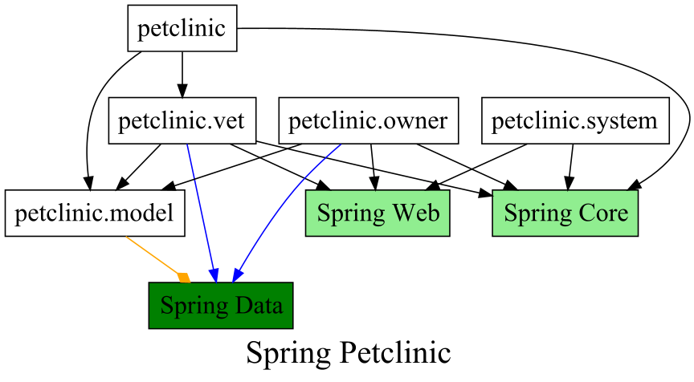

# Packagraph used in Spring-PetClinic project

The contents of this project are an **UNMODIFIED** copy of
the [Petclinic](https://github.com/spring-projects/spring-petclinic) project,
which is licensed under the **Apache 2.0 license**.

The intention of copying the Spring-Petclinic project is solely to provide an
example of "how it works" for **packgraph** users.
**packagraph** processes the source code of Spring-Petclinic project and
generates the package diagram into a graph.

### With `petclinic-exclude-externals.pg`:

### With `petclinic-include-spring.pg`:

